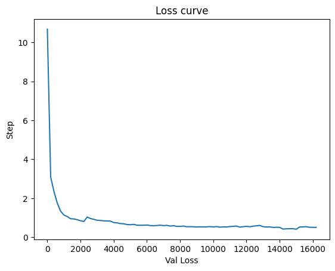

Small GPT model trained on solidity



## quickstart

```sh
python data/seyyedaliayati-solidity-dataset/prepare.py

python data/slither-audited-smart-contracts/prepare.py
```

This creates a `train.bin` and `val.bin` in that specific data directory. Now it is time to train our GPT.

## train the model

```sh
python train.py
```

In train.py we have the variable `dataset = 'seyyedaliayati-solidity-dataset'`. This point to the folder to use that specific train.bin to train our model. Please feel free to switch the folders like `dataset = 'slither-audited-smart-contracts'` to train on both the datasets.

Our program with save a `log.txt` and `ckpt.pt` after every 200 iterations in the `out` directory. We can change the number of iteration interval to save in the `train.py` file. I am not pushing the file `ckpt.pt` at this point as I have only trained for ~16000 iterations and the model file is `1.15 GB`.

## sample from the model

```sh
python sample.py
```

This generates a few samples. for example after training the model for just 16200 iterations we get -

```
pragma solidity ^0.8.0;
abstract contract Context {
    function _msgSender() internal view virtual returns (address) {
        return msg.sender;
    }
    function _msgData() internal view virtual returns (bytes calldata) {
        return msg.data;
    }
}
pragma solidity ^0.8.1;
library Address {
    function isContract(address account) internal view returns (bool) {
        return account.code.length > 0;
    }
    function sendValue(address payable recipient, uint256 amount) internal {
        require(address(this).balance >= amount, "Address: insufficient balance");
        (bool success,) = recipient.call{value: amount}("");
        require(success, "Address: unable to send value, recipient may have reverted");
    }
    function functionCall(address target, bytes memory data) internal returns (bytes memory) {
        return functionCall(target, data, "Address: low-level call failed");
    }
    function functionCall(address target,
        bytes memory data,
        string memory errorMessage) internal returns (bytes memory) {
        return functionCallWithValue(target, data, 0, errorMessage);
    }
    function functionCallWithValue(address target,
        bytes memory data,
        uint256 value) internal returns (bytes memory) {
        return functionCallWithValue(target, data, value, "Address: low-level call with value failed");
    }
    function functionCallWithValue(address target,
        bytes memory data,
        uint256 value,
        string memory errorMessage) internal returns (bytes memory) {
        require(address(this).balance >= value, "Address: insufficient balance for call");
        require(isContract(target), "Address: call to non-contract");
        (bool success, bytes memory returndata) = target.call{value: value}(data);
        return verifyCallResult(success, returndata, errorMessage);
    }
    function functionStaticCall(address target, bytes memory data) internal view returns (bytes memory) {
        return functionStaticCall(target, data, "Address: low-level static call failed");
    }
    function functionStaticCall(address target,
        bytes memory data,
        string memory errorMessage) internal view returns (bytes memory) {
        require(isContract(target), "Address: static call to non-contract");
        (bool success, bytes memory returndata) = target.staticcall(data);
        return verifyCallResult(success, returndata, errorMessage);
    }
    function functionDelegateCall(address target, bytes memory data) internal returns (bytes memory) {
        return functionDelegateCall(target, data, "Address: low-level delegate call failed");
    }
    function functionDelegateCall(address target,
        bytes memory data,
        string memory errorMessage) internal returns (bytes memory) {
        require(isContract(target), "Address: delegate call to non-contract");
        (bool success, bytes memory returndata) = target.delegatecall(data);
        return verifyCallResult(success, returndata, errorMessage);
    }
    function verifyCallResult(bool success,
        bytes memory returndata,
        string memory error
-----------------------------------------------------------------------------
pragma solidity ^0.8.0;
library Strings {
    bytes16 private constant _HEX_SYMBOLS = "0123456789abcdef";
    uint8 private constant _ADDRESS_LENGTH = 20;
    function toString(uint256 value) internal pure returns (string memory) {
        if (value == 0) {
            return "0";
        }
        uint256 temp = value;
        uint256 digits;
        while (temp != 0) {
            digits++;
            temp /= 10;
        }
        bytes memory buffer = new bytes(digits);
        while (value != 0) {
            digits -= 1;
            buffer[digits] = bytes1(uint8(48 + uint256(value % 10)));
            value /= 10;
        }
        return string(buffer);
    }
    function toHexString(uint256 value) internal pure returns (string memory) {
        if (value == 0) {
            return "0x00";
        }
        uint256 temp = value;
        uint256 length = 0;
        while (temp != 0) {
            length++;
            temp >>= 8;
        }
        return toHexString(value, length);
    }
    function toHexString(uint256 value, uint256 length) internal pure returns (string memory) {
        bytes memory buffer = new bytes(2 * length + 2);
        buffer[0] = "0";
        buffer[1] = "x";
        for (uint256 i = 2 * length + 1; i > 1; --i) {
            buffer[i] = _HEX_SYMBOLS[value & 0xf];
            value >>= 4;
        }
        require(value == 0, "Strings: hex length insufficient");
        return string(buffer);
    }
}
-----------------------------------------------------------------------------
pragma solidity ^0.8.0;
import "./IERC165.sol";
interface IERC721 is IERC165 {
    event Transfer(address indexed from, address indexed to, uint256 indexed tokenId);
    event Approval(address indexed owner, address indexed approved, uint256 indexed tokenId);
    event ApprovalForAll(address indexed owner, address indexed operator, bool approved);
    function balanceOf(address owner) external view returns (uint256 balance);
    function ownerOf(uint256 tokenId) external view returns (address owner);
    function safeTransferFrom(address from,
        address to,
        uint256 tokenId) external;
    function transferFrom(address from,
        address to,
        uint256 tokenId) external;
    function approve(address to, uint256 tokenId) external;
    function getApproved(uint256 tokenId) external view returns (address operator);
    function setApprovalForAll(address operator, bool _approved) external;
    function isApprovedForAll(address owner, address operator) external view returns (bool);
    function safeTransferFrom(address from,
        address to,
        uint256 tokenId,
        bytes calldata data) external;
}
pragma solidity ^0.8.0;
interface IERC721Receiver {
    function onERC721Received(address operator,
        address from,
        uint256 tokenId,
        bytes calldata data) external returns (bytes4);
}
pragma solidity ^0.8.0;
interface IERC165 {
    function supportsInterface(bytes4 interfaceId) external view returns (bool);
}
pragma solidity ^0.8.0;
abstract contract ERC1155Receiver {
    function supportsInterface(bytes4 interfaceId) public view virtual override(ERC165, IERC165) returns (bool) {
        return interfaceId == type(IERC1155Receiver).interfaceId || super.supportsInterface(interfaceId);
    }
    function uri(uint256) public view virtual override(IERC165, IERC165) returns (bool) {
        return interfaceId == type(IERC1155Metadata).interfaceId || super.supportsInterface(interfaceId);
    }
    function uri(uint256) public view virtual override(IERC165, IERC165) returns (bool) {
        return interfaceId == type(IERC721Metadata).interfaceId || super.supportsInterface(interfaceId);
    }
    function uri(uint256) public view virtual override(IERC165, IERC165) returns (bool) {
        return interfaceId == type(IERC721Metadata).interfaceId || super.supportsInterface(interfaceId);
    }
}
-----------------------------------------------------------------------------
```

I have only trained the model on my macbook equipped with Apple m1 pro with 32gb of ram with 16 core metal 4 GPU, NOT BAD performance after training for only ~16000 iterations. Can do wonders if we get a good cuda device. I do not have any budget at this point `¯\_(ツ)_/¯`

## finetuning

For the next steps I will fine tune this model to generate solidity code and also for vulnerability detection.

## todos

- Finetune to generate solidity code
- Finetune to detect vulnerability in solidity code.
- Schedule for linear batch size increase during training
- Incorporate other embeddings (rotary, alibi)
- Separate out the optim buffers from model params in checkpoints I think
- Additional logging around network health (e.g. gradient clip events, magnitudes)
- Few more investigations around better init etc.
