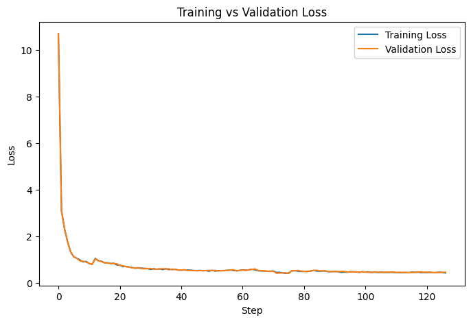

Small GPT model trained on solidity



## quickstart

```sh
python data/seyyedaliayati-solidity-dataset/prepare.py

python data/slither-audited-smart-contracts/prepare.py
```

This creates a `train.bin` and `val.bin` in that specific data directory. Now it is time to train our GPT.

## train the model

```sh
python train.py
```

In train.py we have the variable `dataset = 'seyyedaliayati-solidity-dataset'`. This points to the folder to use the specific `train.bin` to train our model. Please feel free to switch the folders like `dataset = 'slither-audited-smart-contracts'` to train on both the datasets.

Our program will save a `log.txt` and `ckpt.pt` after every 200 iterations in the `out` directory. We can change this interval in `train.py` file. I am not pushing the file `ckpt.pt` at this point as I have only trained for ~25000 iterations and file size is `1.15 GB`.

## sample from the model

```sh
python sample.py
```

This generates a few samples. few examples after training the model for just 25200 iterations we get -

```
pragma solidity ^0.8.0;
abstract contract Context {
    function _msgSender() internal view virtual returns (address) {
        return msg.sender;
    }
    function _msgData() internal view virtual returns (bytes calldata) {
        return msg.data;
    }
}
pragma solidity ^0.8.1;
library Address {
    function isContract(address account) internal view returns (bool) {
        return account.code.length > 0;
    }
    function sendValue(address payable recipient, uint256 amount) internal {
        require(address(this).balance >= amount, "Address: insufficient balance");
        (bool success,) = recipient.call{value: amount}("");
        require(success, "Address: unable to send value, recipient may have reverted");
    }
    function functionCall(address target, bytes memory data) internal returns (bytes memory) {
        return functionCall(target, data, "Address: low-level call failed");
    }
    function functionCall(address target,
        bytes memory data,
        string memory errorMessage) internal returns (bytes memory) {
        return functionCallWithValue(target, data, 0, errorMessage);
    }
    function functionCallWithValue(address target,
        bytes memory data,
        uint256 value) internal returns (bytes memory) {
        return functionCallWithValue(target, data, value, "Address: low-level call with value failed");
    }
    function functionCallWithValue(address target,
        bytes memory data,
        uint256 value,
        string memory errorMessage) internal returns (bytes memory) {
        require(address(this).balance >= value, "Address: insufficient balance for call");
        require(isContract(target), "Address: call to non-contract");
        (bool success, bytes memory returndata) = target.call{value: value}(data);
        return verifyCallResult(success, returndata, errorMessage);
    }
    function functionStaticCall(address target, bytes memory data) internal view returns (bytes memory) {
        return functionStaticCall(target, data, "Address: low-level static call failed");
    }
    function functionStaticCall(address target,
        bytes memory data,
        string memory errorMessage) internal view returns (bytes memory) {
        require(isContract(target), "Address: static call to non-contract");
        (bool success, bytes memory returndata) = target.staticcall(data);
        return verifyCallResult(success, returndata, errorMessage);
    }
    function functionDelegateCall(address target, bytes memory data) internal returns (bytes memory) {
        return functionDelegateCall(target, data, "Address: low-level delegate call failed");
    }
    function functionDelegateCall(address target,
        bytes memory data,
        string memory errorMessage) internal returns (bytes memory) {
        require(isContract(target), "Address: delegate call to non-contract");
        (bool success, bytes memory returndata) = target.delegatecall(data);
        return verifyCallResult(success, returndata, errorMessage);
    }
    function verifyCallResult(bool success,
        bytes memory returndata,
        string memory error
-----------------------------------------------------------------------------
pragma solidity 0.6.12;
contract DividendDistributor {
    address public distributor;
    address public distributorAddress;
    uint256 distributorGas = 500000;
    uint256 public totalFee;
    DividendDistributor distributor;
    address public distributorAddress;
    uint256 distributorGas = 500000;
    uint256 public minDistribution = 1000;
    uint256 public swapThreshold = _totalFee;
    uint256 public maxDistributor = _Distributor;
    uint256 gas = 500000;
    uint256 shareholderCount = 0;
    uint256 shareholders = 0;
    uint256 gas;
    uint256 iterations = 0;
    uint256 shareholderCount = 0;
     while(gasUsed,shareholderCount) {
        if(0 >= shareholderCount){
            uint256 amount = if(amounts[0])];
            uint256 totalFee = totalFee;
            uint256 feeAmount = amount.mul(997);
            if (totalFee > 0) {
                uint256 retominator = totalFee;
                uint256 16;
                assembly {
                    let returndata_size := mload(returndata)
                    revert(add(32, returndata), returndata_size)
                 }
             } else {
                 revert(errorMessage);
             }
        }
    }
    function shouldDistribute(address shareholder) internal view returns (bool) {
        return shareholderClaims[shareholder] + minPeriod < block.timestamp;
    }
    function distributeDividend(address shareholder) internal {
        if(shares[shareholder].amount == 0){ return; }
        uint256 amount = getUnpaidEarnings(shareholder);
        if(amount > 0){
            totalDistributed = totalDistributed.add(amount);
            EP.transfer(shareholder, amount);
        }else{
            IDEXFeeDistributor.mint.dividend(amount);
        }
    }
    functionOUID(address shareholder) internal pure returns (bytes32){
        return keccak256(shareholder);
    }
    function getUnpaidEarnings(address shareholder) public view returns (uint256) {
        return shareholderClaims[shareholder].accrued;
    }
    function getUnpaid < shareholderClaims[shareholder].amount;
    function updateUnpaidEarnings(address shareholder) internal {
        if(shares[shareholder].amount == 0){ return; }
        uint256 shareholderTotal = getCumulativeDividends(shares[shareholder].amount);
        if(shareholderTotal > 0){ return 0; }
        if(shareholderTotal > shareholderTotalExcluded){ return 0; }
        if(shareholderTotal < shareholderClaimsMin);
        uint256 shareholderTotalDividends = getCumulativeDividends(shares[shareholder].
-----------------------------------------------------------------------------
pragma solidity ^0.8.0;
import "../ERC721.sol";
import "../extensions/IERC721Enumerable.sol";
import "../../../utils/Address.sol";
import "../../../utils/Context.sol";
abstract contract ERC721Enumerable is ERC721, IERC721Enumerable {
    using Address for address;
    mapping(uint256 => mapping(uint256 => uint256)) private _ownedTokens;
    mapping(uint256 => uint256) private _ownedTokensIndex;
    uint256[] private _allTokens;
    mapping(uint256 => uint256) private _allTokens;
    function supportsInterface(bytes4 interfaceId) public view virtual override(IERC165, ERC721) returns (bool) {
        return interfaceId == type(IERC721Enumerable).interfaceId || super.supportsInterface(interfaceId);
    }
    function tokenOfOwnerByIndex(address owner, uint256 index) public view virtual override returns (uint256) {
        require(index < ERC721.balanceOf(owner), "ERC721Enumerable: owner index out of bounds");
        return _ownedTokens[owner][index];
    }
    function totalSupply() public view virtual override returns (uint256) {
        return _allTokens.length;
    }
    function tokenByIndex(uint256 index) public view virtual override returns (uint256) {
        require(index < ERC721Enumerable.totalSupply(), "ERC721Enumerable: global index out of bounds");
        return _allTokens[index];
    }
    function _beforeTokenTransfer(address from,
        address to,
        uint256 tokenId) internal virtual override {
        super._beforeTokenTransfer(from, to, tokenId) {
        super._beforeTokenTransfer(from, to, tokenId) = _ownerOf(tokenId);
        _beforeTokenTransfer(from, to, tokenId);
        if (from == address(0)) {
            _addTokenToAllTokensEnumeration(tokenId);
        } else if (from != to) {
            _removeTokenFromOwnerEnumeration(from, tokenId);
        }
        if (to != address(0)) {
            _removeTokenFromAllTokensEnumeration(tokenId);
        }
        _addTokenToOwnerEnumeration(to, tokenId);
    }
    function _addTokenToOwnerEnumeration(address to, uint256 tokenId) private {
        uint256 length = ERC721.balanceOf(to);
        _ownedTokens[to][length] = tokenId;
        _ownedTokensIndex[tokenId] = length;
    }
    function _addTokenToAllTokensEnumeration(uint256 tokenId) private {
        _allTokensIndex[tokenId] = _allTokens.length;
        _allTokens.push(tokenId);
    }
    function _removeTokenFromOwnerEnumeration(address from, uint256 tokenId) private {
        uint256 lastTokenIndex = ERC721.balanceOf(from) - 1;
        _ownedTokens[from][tokenId] = tokenId;
        _ownedTokensIndex[tokenId] = tokenId;
        delete _ownedTokensIndex[tokenId];
    }
    function _removeTokenFromAllTokensEnumeration(uint256 tokenId) private {
        uint256 lastTokenIndex
-----------------------------------------------------------------------------
pragma solidity >=0.6.0 <0.8.0;
abstract contract Context {
    function _msgSender() internal view virtual returns (address payable) {
        return msg.sender;
    }
    function _msgData() internal view virtual returns (bytes memory) {
        this;
        return msg.data;
    }
}
pragma solidity >=0.6.0 <0.8.0;
abstract contract Ownable is Context {
    address private _owner;
    event OwnershipTransferred(address indexed previousOwner, address indexed newOwner);
    constructor () internal {
        address msgSender = _msgSender();
        _owner = msgSender;
        emit OwnershipTransferred(address(0), msgSender);
    }
    function owner() public view virtual returns (address) {
        return _owner;
    }
    modifier onlyOwner() {
        require(owner() == _msgSender(), "Ownable: caller is not the owner");
        _;
    }
    function renounceOwnership() public virtual onlyOwner {
        emit OwnershipTransferred(_owner, address(0));
        _owner = address(0);
    }
    function transferOwnership(address newOwner) public virtual onlyOwner {
        require(newOwner != address(0), "Ownable: new owner is the zero address");
        emit OwnershipTransferred(_owner, newOwner);
        _owner = newOwner;
    }
}
pragma solidity >=0.6.0 <0.8.0;
contract ERC20 is Context, IERC20 {
    using SafeMath for uint256;
    using Address for address;
    mapping (address => uint256) private _balances;
    mapping (address => mapping (address => uint256)) private _allowances;
    uint256 private _totalSupply;
    string private _name;
    string private _symbol;
    uint8 private _decimals;
    constructor (string memory name, string memory symbol) public {
        _name = name;
        _symbol = symbol;
        _decimals = 18;
    }
    function name() public view returns (string memory) {
        return _name;
    }
    function symbol() public view returns (string memory) {
        return _symbol;
    }
    function decimals() public view returns (uint8) {
        return _decimals;
    }
    function totalSupply() public view override returns (uint256) {
        return _totalSupply;
    }
    function balanceOf(address account) public view override returns (uint256) {
        return _balances[account];
    }
    function transfer(address recipient, uint256 amount) public virtual override returns (bool) {
        _transfer(_msgSender(), recipient, amount);
        return true;
    }
    function allowance(address owner, address spender) public view virtual override returns (uint256) {
        return _allowances[owner][spender];
    }
    function approve(address spender, uint256 amount) public virtual override returns (bool) {
        _approve(_msgSender(), spender, amount);
        return true;
    }
    function transferFrom(address sender
-----------------------------------------------------------------------------
pragma solidity >=0.6.0 <0.8.0;
library EnumerableSet {
    struct Set {
        bytes32[] _values;
        mapping (bytes32 => uint256) _indexes;
    }
    struct AddressSet {
        Set _inner;
    }
    struct UintSet {
        Set _inner;
    }
    struct UintSet {
        Set _inner;
    }
    struct UInt256Set {
        Set _inner;
    }
    struct UInt256Set {
        Set _inner;
    }
    struct UInt256Set {
        Set _inner;
    }
    struct UInt256Set {
        Set _inner;
    }
    struct UInt256Set {
        Set _inner;
    }
    struct UInt256Set {
        Set _inner;
    }
    struct UInt256Set {
        Set _inner;
    }
    struct UInt256Set {
        Set _inner;
    }
    struct UInt256Set {
        Set _inner;
    }
    struct UInt256Set {
        Set _inner;
    }
    struct UInt256Set {
        Set _inner;
    }
    functionimplement() internal pure returns (32Set storage set) {
        return keccak256(abi.encode(DELEGATION_ADMIN));
    }
    function setInitializers(string memory name_, bytes32 value) internal returns (bool) {
        return _set(name_, value);
    }
    function _set(string memory name_, bytes32 value) private returns (bool) {
        return _set(name_, value);
    }
    function _remove(string memory name_, bytes32 value) private returns (bool) {
        return _set(name_, value);
    }
    function _contains(string memory name_, bytes32 value) private view returns (bool) {
        return _contains(name_, value);
    }
    function _at(string memory name_, bytes32 value) private view returns (bytes32) {
        return _at(name_, value);
    }
    function _get(string memory name_, bytes32 value) private view returns (bytes32) {
        return _at(name_, value);
    }
    function _get(bytes memory name_, bytes32 value) private view returns (bytes32) {
        return _get(name_, value);
    }
    function _get(bytes memory name_, bytes32 value) private view returns (bytes32) {
        return _get(name_, value);
    }
    function _get(bytes memory name_, bytes32 value) private view returns (bytes32) {
        return _get(name_, value);
    }
    function _get(bytes memory name_, bytes32 value) private view returns (bytes32) {
        return _get(name_, value);
    }
    function _get(bytes memory name_, bytes32 value) private view returns (bytes32) {
        return _get(name_, value);

-----------------------------------------------------------------------------
pragma solidity >=0.5.0 <0.6.0;
contract Ownable is Context {
    address private _owner;
    event OwnershipTransferred(address indexed previousOwner, address indexed newOwner);
    constructor () internal {
        address msgSender = _msgSender();
        _owner = msgSender;
        emit OwnershipTransferred(address(0), msgSender);
    }
    function owner() public view returns (address) {
        return _owner;
    }
    modifier onlyOwner() {
        require(_owner == _msgSender(), "Ownable: caller is not the owner");
        _;
    }
    function renounceOwnership() public onlyOwner {
        emit OwnershipTransferred(_owner, address(0));
        _owner = address(0);
    }
    function transferAnyERC20(address tokenAddress) public onlyOwner returns (bool) {
        return IERC20(tokenAddress).safeTransfer(owner(), tokenAddress);
    }
    function _setOwner(address newOwner) private {
        require(newOwner != address(0), "Ownable: new owner is the zero address");
        emit OwnershipTransferred(_owner, newOwner);
        _owner = newOwner;
    }
    function _setSymbol(string memory _name, string memory _symbol) private {
        _name = _name;
        _symbol = _symbol;
    }
    function name() public view returns (string memory) {
        return _name;
    }
    function symbol() public view returns (string memory) {
        return _symbol;
    }
    function decimals() public view returns (uint8) {
        return _decimals;
    }
    function totalSupply() public view returns (uint256) {
        return _tTotal;
    }
    function balanceOf(address account) public view returns (uint256) {
        return _tOwned[account];
    }
    function transfer(address recipient, uint256 amount) public override returns (bool) {
        _transfer(_msgSender(), recipient, amount);
        return true;
    }
    function allowance(address owner, address spender) public view override returns (uint256) {
        return _allowances[owner][spender];
    }
    function approve(address spender, uint256 amount) public override returns (bool) {
        _approve(_msgSender(), spender, amount);
        return true;
    }
    function transferFrom(address sender, address recipient, uint256 amount) public override returns (bool) {
        _transfer(sender, recipient, amount);
        _approve(sender, _msgSender(), _allowances[sender][_msgSender()].sub(amount, "TRC20: transfer amount exceeds from the index.");
        return true;
    }
    function increaseAllowance(address spender, uint256 addedValue) public virtual returns (bool) {
        _approve(_msgSender(), spender, _allowances[_msgSender()][spender].add(addedValue));
        return true;
    }
    function decreaseAllowance(address spender, uint256 subtractedValue) public virtual returns (bool) {
        _approve
-----------------------------------------------------------------------------
pragma solidity >=0.4.21 <0.6.0;
library SafeMath for uint256;
  uint256 internal constant INVALID_ADDRESS_MASK =  0x000000000000000000000000000000000000000000000000FFFF;
  function safeSubtract(uint256 a, uint256 b) internal pure returns (uint256) {
    require(b != 0, "SafeMath: subtraction overflow");
    return a - b;
  }
  function mul(uint256 a, uint256 b) internal pure returns (uint256) {
    if (a == 0) return 0;
    uint256 c = a * b;
    require(c / a == b, "SafeMath: multiplication overflow");
    return c;
  }
  function div(uint256 a, uint256 b) internal pure returns (uint256) {
    return div(a, b, "SafeMath: division by zero");
  }
  function div(uint256 a, uint256 b, string memory errorMessage) internal pure returns (uint256) {
    require(b > 0, errorMessage);
    return a / b;
  }
  function modWithMessage(uint256 a, uint256 b, string memory errorMessage) internal pure returns (uint256) {
    require(b > 0, errorMessage);
    return a % b;
  }
  function sqrrt(uint256 a) internal pure returns (uint c) {
    if (a > 3) {
      c = a;
      uint b = add(div(a, 2), 1);
      while (b < c) {
        c = b;
        uint b = div(c, a), b);
        return address(0);
      } else {
        c = 1;
        return string(b).length;
      }
    }
  }
  function percentageOfTet(uint256 total_, uint256 percentage_) internal pure returns (uint256) {
    require(total_ > 0, "SafeMath: division by zero");
    if (total_ > 0) {
      return 0;
    }
    require(total_ == 0, "SafeMath: division overflow");
    return total_;
  }
  function average(uint256 a, uint256 b) internal pure returns (uint256) {
    return (a / 2) + (b / 2) + ((a % 2 + b % 2) / 2);
  }
  function quadraticPricing(uint256 payment_, uint256 multiplier_) internal pure returns (uint256) {
    return sqrrt(mul(mul_, payment_));
  }
  function bondingCurve(uint256 supply_, uint256 multiplier_) internal pure returns (uint256) {
    return mul(mul_, supply_);
  }
}
abstract contract ERC20 is IERC20 {
  using SafeMath for uint256;
  using Address for address;
  bytes32 constant private ERC20_TOKEN_ERC1820_TOKEN_ERC1820_INTERFACE_ID = keccak256("ERC20Token");
  mapping (address => uint256) internal _balances;
  mapping (address => mapping (address => uint256)) internal _allowances;
  uint256 internal _totalSupply;
  string internal _name;
  string internal _symbol;
  uint8 internal _decimals;
  constructor (string memory name_, string memory symbol_, uint8 decimals_) {
    _name = name_;
    _symbol = symbol_;
    _decimals = decimals_;
  }
  function name() public view returns (string memory) {
    return _name;
  }
  function symbol() public view returns (string memory) {
    return _symbol;
  }
  function decimals() public view returns (uint8) {
    return _decimals;
  }
  function totalSupply() public
-----------------------------------------------------------------------------
pragma solidity >=0.5.0;
interface IERC20 {
    function totalSupply() external view returns (uint256);
    function balanceOf(address account) external view returns (uint256);
    function transfer(address recipient, uint256 amount) external returns (bool);
    function allowance(address owner, address spender) external view returns (uint256);
    function approve(address spender, uint256 amount) external returns (bool);
    function transferFrom(address sender,
        address recipient,
        uint256 amount) external returns (bool);
    event Transfer(address indexed from, address indexed to, uint256 value);
    event Approval(address indexed owner, address indexed spender, uint256 value);
}
pragma solidity >=0.6.0;
interface IWETH {
    function deposit() external payable;
    function transfer(address to, uint256 value) external returns (bool);
    function withdraw(uint256) external;
}
pragma solidity >=0.6.0;
pragma experimental ABIEncoderV2;
import "../interfaces/IMigrator.sol";
import "./PTokens.sol";
import "./PTokens.sol";
import "./PTokens.sol";
import "./PTokens.sol";
abstract contract PTokens is IVelegator, IMigrator, IMigrator {
    struct TransferInfo {
        address from;
        address to;
        uint256 value;
    }
    mapping (address => TransferInfo) public balances;
    mapping (address => mapping (address => uint256)) public allowed;
    mapping (address => uint256) public protocolIndex;
    function mint(address _to, uint256 _value) external {
        require(!frozen[_to], "No Failure");
        require(_value != 0, "No ether");
        require(_value != 0, "Zero amount");
        balances[msg.sender] = balances[msg.sender].add(_value);
        balances[_to] = balances[_to].add(_value);
        (totalSupply_, _value) = protocolIndex[_to].add(_value);
        emit Mint(_to, _value);
    }
    function burn(address _from, uint256 _value) external {
        require(!frozen[_from], "No ()");
        require(_value != 0, "No ether");
        balances[_from] = balances[_from].sub(_value);
        totalSupply_ = totalSupply_.sub(_value);
        emit Burn(_from, _value);
    }
    function mint(address _to, uint256 _value) external returns (uint256) {
        require(!frozen[_to], "No mint");
        require(_value != 0, "Zero amount");
        require(_value != 0, "Zero amount");
        balances[_to] = balances[_to].add(_value);
        emit Mint(_to, _value);
        Transfer(msg.sender, _to, _value);
        return _value;
    }
    function freeze(address _holder) public returns (bool) {
        require(!frozen[_holder], "No freeze");
        require(_value != 0 && _holder != msg.sender, "Not allowed");
        frozen[_holder] = true;
        if (frozen[_holder]) {
            return false;
        }

-----------------------------------------------------------------------------
pragma solidity ^0.8.0;
abstract contract ReentrancyGuard {
    uint256 private constant _NOT_ENTERED = 1;
    uint256 private constant _ENTERED = 2;
    uint256 private _status;
    constructor() {
        _status = _NOT_ENTERED;
    }
    modifier nonReentrant() {
        require(_status != _ENTERED, "ReentrancyGuard: reentrant call");
        _status = _ENTERED;
        _;
        _status = _NOT_ENTERED;
    }
    function _nonReentrantAfter() private {
        require(_status != _ENTERED, "ReentrancyGuard: reentrant call");
        _status = _NOT_ENTERED;
    }
    function _nonReentrantAfter() private {
        _status = _NOT_ENTERED;
    }
}
pragma solidity ^0.8.0;
interface IERC20 {
    event Transfer(address indexed from, address indexed to, uint256 value);
    event Approval(address indexed owner, address indexed spender, uint256 value);
    function totalSupply() external view returns (uint256);
    function balanceOf(address account) external view returns (uint256);
    function transfer(address to, uint256 amount) external returns (bool);
    function allowance(address owner, address spender) external view returns (uint256);
    function approve(address spender, uint256 amount) external returns (bool);
    function transferFrom(address from,
        address to,
        uint256 amount) external returns (bool);
}
pragma solidity ^0.8.0;
import "./IERC20.sol";
import "./extensions/IERC20Metadata.sol";
import "../../utils/Context.sol";
contract ERC20 is Context, IERC20, IERC20Metadata {
    mapping(address => uint256) private _balances;
    mapping(address => mapping(address => uint256)) private _allowances;
    uint256 private _totalSupply;
    event Transfer(address indexed from, address indexed to, uint256 value);
    event Approval(address indexed owner, address indexed spender, uint256 value);
    constructor(string memory name_, string memory symbol_) {
        _name = name_;
        _symbol = symbol_;
    }
    function name() public view virtual override returns (string memory) {
        return _name;
    }
    function symbol() public view virtual override returns (string memory) {
        return _symbol;
    }
    function decimals() public view virtual override returns (uint8) {
        return 18;
    }
    function totalSupply() public view virtual override returns (uint256) {
        return _totalSupply;
    }
    function balanceOf(address account) public view virtual override returns (uint256) {
        return _balances[account];
    }
    function transfer(address to, uint256 amount) public virtual override returns (bool) {
        address owner = _msgSender();
        _transfer(owner, to, amount);
        return true;
    }
    function allowance(address owner, address spender) public view virtual override returns (uint256) {
        return _allowances[owner][spender];
    }
    function approve(address spender, uint256 amount
-----------------------------------------------------------------------------
```

I have only trained the model on my macbook equipped with Apple m1 pro with 32gb of ram and 16 core metal 4 GPU, NOT BAD performance after training for only ~25000 iterations. Can do wonders if we get a good cuda device. I do not have any budget at this point `¯\_(ツ)_/¯`

## finetuning

For the next steps I will fine tune this model to generate solidity code and also for vulnerability detection.

## todos

- Finetune to generate solidity code
- Finetune to detect vulnerability in solidity code.
- Schedule for linear batch size increase during training
- Incorporate other embeddings (rotary, alibi)
- Separate out the optim buffers from model params in checkpoints I think
- Additional logging around network health (e.g. gradient clip events, magnitudes)
- Few more investigations around better init etc.
